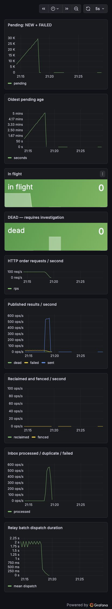
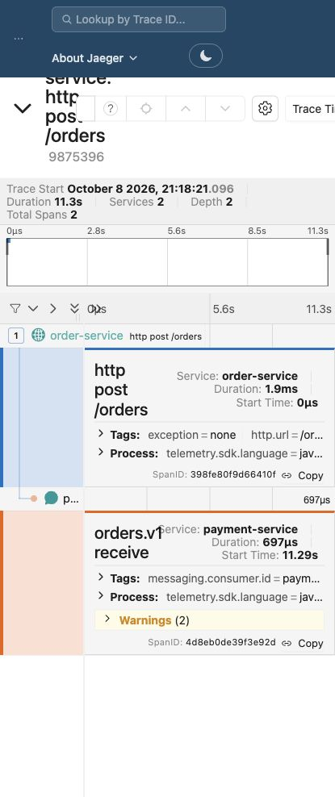
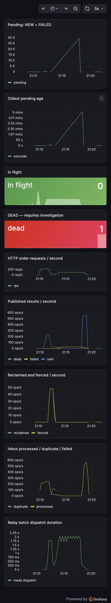

# Результаты демо этапа 1

Дата генерального прогона: 2026-10-08; завершение проверки окончательного кода — 21:24 +03. Чистые тома только проекта reliable-messaging-kit.

JDK 21, Spring Boot 3.5.16, PostgreSQL 16.15, Kafka 4.3.0; Docker/Testcontainers без пропусков.

Полная сборка: `./gradlew clean build :outbox-spring-boot-starter:publishToMavenLocal --no-build-cache` — PASS, все 25 задач выполнены. 54 теста стартера и 1 тест демо; ошибок, падений и пропусков — 0.

Стабильность: `scripts/repeat-tests.sh 10` — 10 последовательных PASS на окончательном коде за 313 секунд. Сохранённая [сводка тестов](demo-1-evidence/test-verification.txt) находится вне очищаемого `build/`; runner пишет подробные логи каждого повторения в `outbox-spring-boot-starter/build/repeat-tests/`.

## rollback — PASS

Команда: `demo-stand/scripts/scenario-rollback.sh`.

| Проверка | Значение |
|---|---:|
| Заказы | 0 |
| Доставки | 0 |
| Уникальные message_id | 0 |
| Платежи | 0 |
| Уникальные order_id | 0 |
| Заказы без платежа | 0 |
| Платежи-дубли | 0 |
| Платежи без заказа | 0 |

## kill9-naive — PASS

Команда: `demo-stand/scripts/scenario-kill9.sh naive`.

| Проверка | Значение |
|---|---:|
| Заказы | 14095 |
| Доставки | 14077 |
| Уникальные message_id | 14077 |
| Платежи | 14077 |
| Уникальные order_id | 14077 |
| Заказы без платежа | 18 |
| Платежи-дубли | 0 |
| Платежи без заказа | 0 |

Расхождение здесь ожидаемо: продемонстрирована потеря naive dual-write.

## kill9-outbox — PASS

Команда: `demo-stand/scripts/scenario-kill9.sh outbox`.

| Проверка | Значение |
|---|---:|
| Заказы | 14092 |
| Доставки | 14092 |
| Уникальные message_id | 14092 |
| Платежи | 14092 |
| Уникальные order_id | 14092 |
| Заказы без платежа | 0 |
| Платежи-дубли | 0 |
| Платежи без заказа | 0 |
| Outbox SENT | 14092 |

## three-relays — PASS

Команда: `demo-stand/scripts/scenario-three-relays.sh`.

| Проверка | Значение |
|---|---:|
| Заказы | 1501 |
| Доставки | 4293 |
| Уникальные message_id | 1501 |
| Платежи | 1501 |
| Уникальные order_id | 1501 |
| Заказы без платежа | 0 |
| Платежи-дубли | 0 |
| Платежи без заказа | 0 |
| Outbox SENT | 1501 |

## replay — PASS

Команда: `demo-stand/scripts/scenario-replay.sh`.

| Проверка | Значение |
|---|---:|
| Заказы | 1501 |
| Доставки | 8586 |
| Уникальные message_id | 1501 |
| Платежи | 1501 |
| Уникальные order_id | 1501 |
| Заказы без платежа | 0 |
| Платежи-дубли | 0 |
| Платежи без заказа | 0 |
| Outbox SENT | 1501 |

## kafka-down-5m — PASS

Команда: `demo-stand/scripts/scenario-kafka-down.sh 5`.

| Проверка | Значение |
|---|---:|
| Заказы | 33000 |
| Доставки | 33000 |
| Уникальные message_id | 33000 |
| Платежи | 33000 |
| Уникальные order_id | 33000 |
| Заказы без платежа | 0 |
| Платежи-дубли | 0 |
| Платежи без заказа | 0 |
| Outbox SENT | 33000 |

## Наблюдаемость

Prometheus получает реальные счётчики и снимки очереди; Grafana показывает рост при остановке Kafka и дренаж после восстановления.

Jaeger: один trace включает `http post /orders` (order-service) и `orders.v1 receive` (payment-service).

[Исходный trace из Jaeger API](demo-1-evidence/final-trace.json): 2 сервиса, 2 span, trace_id `98753962055374e01b07b91bb05b90bd`.

Правило `OutboxDeadMessages` проверено живой диагностической строкой: после 30 секунд состояние `firing`, значение 1; панель DEAD стала красной. [Ответ Prometheus](demo-1-evidence/dead-alert.json). Строка после проверки удалена; финальная сверка: 33 000 SENT, DEAD = 0.

Допустимые дубли доставок видны в delivery_log; бизнес-эффекты при outbox + inbox остаются однократными.

Скрипты сценариев и их результаты относятся к проверке корректности этапа 1; сравнительные замеры производительности остаются для этапа 2.
