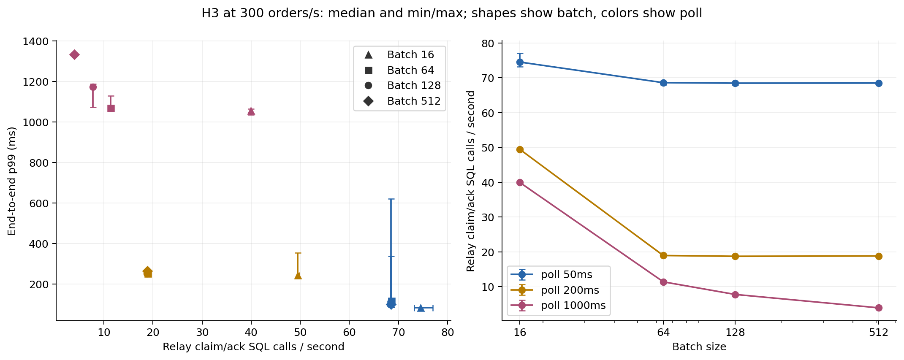
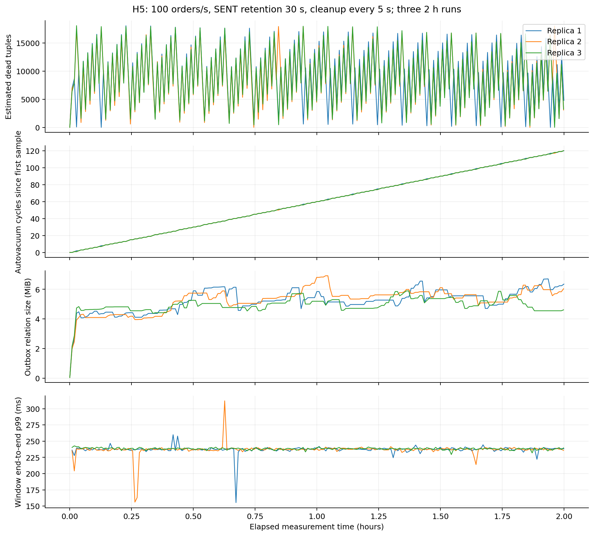

# H2, H3 и H5: виртуальные потоки, сетка настроек, autovacuum

Прогоны 9 октября 2026 года (UTC). H2 и H3 выполнены на двух независимых Ubuntu 24.04 VM:
внутри каждой гипотезы все конфигурации последовательно проходят на одной машине. H5 — три
независимые VM по два часа. Docker сообщает 4 CPU, 16 GiB, x86_64; service quotas зафиксированы
в `compose.perf.yml`. Это отдельные группы `gha-virtual`, `gha-matrix`, `gha-h5`, не локальный ARM64 baseline.

Короткая конфигурация: новая JVM → 60 s прогрева → 3 × 180 s измерения. Между повторениями
очищаются таблицы и topics остаются теми же; между конфигурациями JVM и topics пересоздаются.
В таблицах медиана и min/max трёх прогонов. E2e p99 — интерполированная разность histogram buckets,
HTTP p99 — k6 Trend. Коллекторы проверили полную сетку, длительность, непрерывные часы, raw JSON,
завершённый manifest, отсутствие dropped iterations, ошибок HTTP, потерь и повторных платежей.

## H2: те же два воркера, Hikari 10/20

Виртуальная фабрика меняет тип потоков, сохраняя два долгоживущих воркера. Это не новый поток на
каждое событие. Нагрузка во всех четырёх конфигурациях — 500 orders/s; пропускная способность
в этих прогонах ограничена входным потоком, поэтому максимальную capacity из них вывести нельзя.

| Режим / Hikari | HTTP p99, ms | E2e p99, ms | Order CPU, % медиана | L = λW, соединений |
|---|---:|---:|---:|---:|
| Platform / 10 | 9,59 [8,24; 9,61] | 446,19 [429,00; 463,42] | 33,24 | 0,570 |
| Platform / 20 | 8,03 [7,22; 10,03] | 422,12 [415,26; 458,21] | 36,24 | 0,586 |
| Virtual / 10 | 8,44 [7,55; 47,22] | 432,23 [414,53; 5702,69] | 33,11 | 0,581 |
| Virtual / 20 | 8,56 [8,34; 10,55] | 428,63 [421,23; 430,79] | 33,83 | 0,595 |

При Hikari=10 медиана e2e улучшилась на 3,13%, но худший прогон дал 5,7 s. При Hikari=20 virtual
медиана хуже platform на 1,54%. HTTP median / pool=10 улучшилась на 11,96%, однако её максимальный
p99 одновременно вырос почти в пять раз: три последовательных прогона не отделяют этот эффект
от шума окружения. Выброс не исключён: временное окно и доставка валидны. Устойчивого выигрыша,
который обосновывал бы virtual по умолчанию, нет. Предсказание H2 согласуется с e2e медианой,
но обещание универсального выигрыша менее 10% не подтверждается всеми HTTP числами.

Docker CPU: 100% означает один core, квота order-service — 200%. Таблица показывает медиану
среднего CPU каждого прогона, а не отношение к четырём CPU хоста.

### Закон Литтла и проверка пула

λ — число завершённых Hikari leases за секунду, W — средняя длительность usage одного соединения.
Обе величины включают HTTP-транзакции и relay SQL. В каждом прогоне считается `usage_sum / 180`,
что равно λ × W; затем берётся медиана этих произведений. Это средняя занятость, не гарантия
отсутствия очереди при burst и не самостоятельная формула безопасного максимального пула.

| Режим / pool | λ, leases/s median | W, ms median | λW median | Active gauge mean, median |
|---|---:|---:|---:|---:|
| Platform / 10 | 519,03 | 1,098 | 0,570 | 1,000 |
| Platform / 20 | 519,05 | 1,129 | 0,586 | 0,941 |
| Virtual / 10 | 518,95 | 1,120 | 0,581 | 0,824 |
| Virtual / 20 | 518,92 | 1,146 | 0,595 | 0,706 |

Около 0,6 среднего занятого соединения существенно ниже 10. Снимки active также остаются
около одного, но снимаются редко и зависят от фазы polling: их нельзя считать точным интегралом
занятости. Удвоение пула не даёт сопоставимого выигрыша e2e. Это подтверждает запас на данной
нагрузке; производственный pool всё равно требует проверки своего burst/SQL latency.

Pinning оценивается отдельными полными JFR captures, с `jdk.VirtualThreadPinned` ≥1 ms
и `-Djdk.tracePinnedThreads=full`. Async-profiler CPU/wall может обрывать virtual стеки на
continuation barrier; его атрибутированные доли не являются полной долей времени виртуального
воркера ([ограничение профилировщика](https://github.com/async-profiler/async-profiler/discussions/1745)).
Конкретные JFR события и кадры приводятся в отчёте профилирования после завершения captures.

## H3: все 12 сочетаний на 300 orders/s

| Batch | Poll, ms | E2e p99, ms median [min; max] | Claim/ack SQL/s median [min; max] |
|---:|---:|---:|---:|
| 16 | 50 | 84,19 [83,22; 86,20] | 74,51 [73,23; 77,00] |
| 16 | 200 | 244,09 [226,92; 354,84] | 49,43 [49,36; 49,82] |
| 16 | 1000 | 1056,47 [1035,96; 1064,19] | 39,93 [39,92; 40,03] |
| 64 | 50 | 118,26 [85,98; 126,21] | 68,58 [67,97; 68,79] |
| 64 | 200 | 252,23 [251,06; 258,48] | 18,96 [18,94; 18,99] |
| 64 | 1000 | 1067,78 [1064,82; 1129,41] | 11,41 [11,39; 11,41] |
| 128 | 50 | 104,90 [85,09; 620,75] | 68,45 [67,80; 68,77] |
| 128 | 200 | 252,77 [249,05; 259,67] | 18,74 [18,69; 18,84] |
| 128 | 1000 | 1171,62 [1071,57; 1186,36] | 7,79 [7,75; 7,81] |
| 512 | 50 | 100,98 [88,71; 337,63] | 68,47 [68,39; 68,48] |
| 512 | 200 | 264,31 [250,14; 264,58] | 18,82 [18,76; 18,83] |
| 512 | 1000 | 1331,82 [1329,53; 1338,06] | 3,94 [3,94; 3,94] |

H3 подтверждается с оговоркой о наполнении пачки. При poll=1000 рост batch 16→512 снижает
claim/ack SQL с 39,93 до 3,94/s, увеличивая e2e median с 1056 до 1332 ms. При poll=50 пачки
64/128/512 не наполняются: SQL остаётся около 68,5/s, а p99 не растёт монотонно. Ускорение poll
128/200→128/50 даёт e2e median 253→105 ms ценой 18,7→68,5 SQL/s; худший p99 — 621 ms.

Для данных условий оставлены batch=128 и poll=200ms: все три e2e p99 249–260 ms, SQL около
18,7/s. Batch=512 не снижает SQL при этом poll, batch=16 увеличивает его до 49,4/s. Poll=50ms
подходит для меньшей задержки, но требует большей SQL-нагрузки. Полезность иной настройки
проверяется на своём входном потоке; эти числа не переносятся на saturation без замера.

## H5: три полных двухчасовых окна

100 orders/s, SENT retention=30s, cleanup каждые 5s. Каждый k6 сценарий длился ровно 7200 s;
wall harness длиннее из-за запуска/опроса процесса, в допустимом диапазоне 7200–7260 s.

| Реплика | Wall, s | Заказов / платежей | Максимум estimated dead tuples | Autovacuum cycles | Relation max / final, MiB |
|---:|---:|---:|---:|---:|---:|
| 1 | 7228,89 | 720001 / 720001 | 18048 | 120 | 6,70 / 6,35 |
| 2 | 7224,13 | 720001 / 720001 | 17988 | 120 | 6,91 / 6,04 |
| 3 | 7224,05 | 720000 / 720000 | 18067 | 120 | 5,89 / 4,62 |

Суммарно 2 160 002 заказа, потерь, повторных бизнес-эффектов, dropped iterations и HTTP errors — 0.
E2e p99 median 237,83 ms [237,64; 238,46], HTTP p99 median 4,50 ms [4,39; 4,96].
`n_dead_tup` — оценка PostgreSQL; размер включает таблицу и индексы.

Dead tuples регулярно возвращаются вниз; каждый runner выполняет около одного vacuum в минуту.
После начального заполнения размер колеблется примерно в пределах 4–7 MiB, без непрерывного
роста на этом двухчасовом окне. Конечный размер не обязан уменьшаться после удаления: страницы
могут повторно использоваться. V3 с изменением scale factor не добавлена — улучшение не доказано.
H5 подтверждает устойчивость autovacuum на 100 orders/s, но не определяет первый предел capacity
на большей нагрузке и не обещает отсутствие bloat при других retention/cleanup параметрах.

Источники: [H2/H3 workflow](https://github.com/kinyha/reliable-messaging-kit/actions/runs/37928804145)
и [H5 workflow](https://github.com/kinyha/reliable-messaging-kit/actions/runs/37927612096).
H2/H3 measurement шаги завершились; общий H2 job позже отказал на необязательном форматировании
вызова профилировщика. Коллектор принимает measurement manifests со status=complete отдельно
от незавершённых profiles. Raw summaries, samples и manifests сохранены в `perf-harness/results/`.
